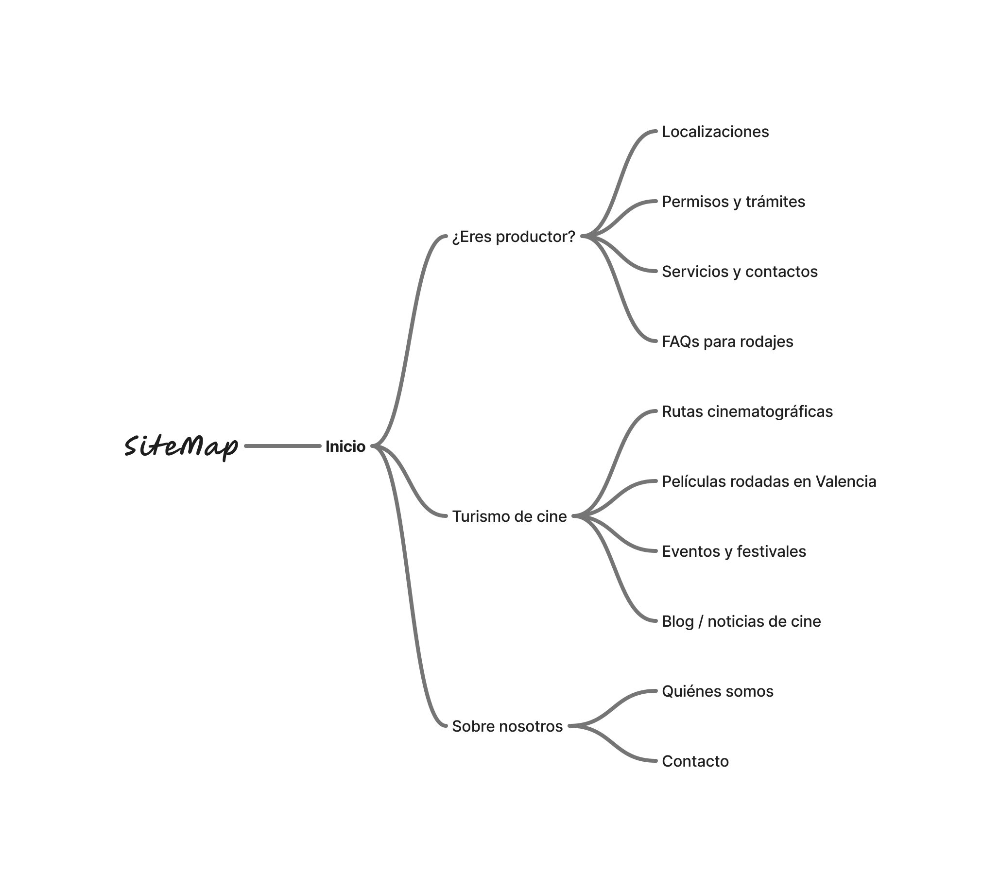

# DIU-FINAL

# Parte I – Mi experiencia UX
Durante la asignatura de Diseño de Interfaces de Usuario he podido desarrollar una mirada más crítica hacia la interacción entre personas y ordenadores. Diseñar no se trata solo de crear pantallas bonitas, sino de planear experiencias que realmente ayuden al usuario. Gracias a distintas tareas centradas en analizar, diseñar y evaluar interfaces, he aprendido a usar herramientas y métodos UX que me han ayudado a tomar decisiones más acertadas y a encontrar errores con razones claras. Esta parte del trabajo recoge una reflexión sobre lo que hicimos y lo que aportó cada actividad desde la mirada del diseño centrado en el usuario.

## Evaluación heurística: Checklist de diseño web
Una de las primeras tareas fue aplicar una checklist de diseño web al portal "La Ampliadora" para ver cómo funcionaba su usabilidad. Esta herramienta fue muy útil para hacer el análisis de forma ordenada, mirando cosas como el aspecto visual, la navegación, los textos y cómo orientarse dentro de la página. Aunque antes de la asignatura ya podía notar algunos fallos como usuario, esta actividad me ayudó a entender la importancia de tener herramientas que nos ayuden a evaluar sin basarnos solo en lo que sentimos.

Usar esta checklist nos permitió encontrar errores que parecen pequeños, como que no haya breadcrumbs o que falten títulos en las páginas, pero que en realidad dificultan que el usuario sepa dónde está o cómo volver atrás. Al comparar con otra web parecida, como Filmosofía, vimos que muchos sitios del mismo tipo comparten esos problemas, y que una buena estructura de navegación mejora mucho la experiencia del usuario, evitando que se frustre o se pierda.

Desde un punto de vista metodológico, esta tarea fue un buen ejemplo de evaluación experta usando reglas generales (heurísticas). Es una técnica que recomiendan usar cuando no hay mucho tiempo ni recursos, según el artículo “When to Use Which UX Research Methods” de NNGroup. Me pareció una forma rápida pero efectiva de encontrar problemas importantes, incluso sin contar con la participación de usuarios reales.

## Accesibilidad y diseño inclusivo: Evaluación del portal del Ayuntamiento de Huétor Vega
La actividad sobre accesibilidad me ayudó a ver, de forma práctica, los obstáculos que enfrentan personas con discapacidades cuando navegan por una web. En este caso, analizamos la página del Ayuntamiento de Huétor Vega usando herramientas como WAVE, Accessibility Insights y simuladores como Funkify. Gracias a esto, comprendí una nueva perspectiva: la de quienes encuentran barreras digitales por motivos visuales, motrices o cognitivos.

Vimos problemas como enlaces sin descripción, falta de encabezados y textos con poco contraste. Aunque el sitio parecía funcionar bien para la mayoría, notamos que muchas personas quedarían fuera de una experiencia completa. Esto demuestra que algo puede estar “bien” a simple vista, pero seguir siendo excluyente.

Además, me impactó especialmente el uso de simuladores como Funkify, que permiten experimentar cómo navega una persona con daltonismo o con temblores en las manos. Por ejemplo, cuando simulé una dislexia ligera, me resultó difícil mantener la atención en una lista de enlaces sin una jerarquía visual clara. Esto me hizo darme cuenta de que el diseño que no tiene en cuenta la diversidad puede convertirse en una barrera más que en una solución.

Aprendí que seguir las reglas WCAG no es solo cumplir la ley, sino tener una actitud responsable como diseñadores. También entendí que la accesibilidad no se puede dejar para el final, como un extra, sino que hay que incluirla desde el principio del diseño. Usar revisiones automáticas junto a simulaciones de usuario me pareció un método muy completo, fácil de aplicar y muy útil, sobre todo en proyectos donde no se puede contactar con usuarios con discapacidad.

Esta tarea también me ayudó a mejorar mi propia forma de diseñar. Ahora suelo revisar siempre si hay buen contraste, si los botones se entienden bien y si la estructura es clara. Creo que ese cambio de mentalidad es uno de los más importantes que me llevo de la asignatura.

## Microinteracciones y diseño emocional: Animación onboarding
Otra actividad muy útil fue crear una animación de pantalla de carga con Figma. Con mi compañero hicimos una animación tipo onboarding que simulaba una barra de carga con pequeños movimientos. Usamos transiciones como Smart Animate y Dissolve. La idea era que, mientras cargaba una pantalla de login, el usuario tuviera una sensación más agradable y no solo esperara sin saber qué pasaba.

Al principio parecía una tarea menor, pero luego entendí que estas animaciones hacen que la espera parezca más corta. Tal como se menciona en el libro de Aarron Walter, el diseño emocional hace que los productos parezcan más humanos. Las microinteracciones dan personalidad, ayudan a comunicar mejor y hacen que la interfaz sea más clara sin necesidad de explicar tanto.

También aprendí a usar Figma para hacer prototipos con animaciones. Esto es muy útil cuando trabajas en grupo, porque ayuda a mostrar mejor cómo debería funcionar algo. Usar animaciones con sentido (y no solo por hacer bonito) mejora mucho la experiencia. Gracias a esta tarea, empecé a fijarme más en detalles como el tiempo de animación, los retardos o la forma en que aparecen los elementos.

Las microinteracciones son además fundamentales para mejorar la percepción de control del usuario. Por ejemplo, si una interfaz responde con un pequeño movimiento o cambio de color al hacer clic, el usuario siente que su acción fue reconocida, aunque aún no haya respuesta del sistema. Este tipo de respuestas mejora la confianza en el producto y reduce la ansiedad del usuario ante la incertidumbre.

## Trabajo en equipo y colaboración en diseño UX
Un aspecto que no estaba recogido directamente en las actividades, pero que considero clave en mi experiencia, fue el trabajo colaborativo. En varias de las tareas, especialmente la animación y la checklist, tuve que trabajar en pareja o en grupo. Esto me permitió entender que el diseño UX no es una tarea individual, sino que se construye a partir del diálogo entre perfiles distintos.

En el proceso aprendí a ceder, a defender ideas con argumentos y también a integrar propuestas ajenas. En el caso de la checklist, por ejemplo, yo pensaba que algunos errores eran poco importantes, pero mi compañero argumentó que ciertos fallos en el wayfinding podían confundir incluso a usuarios expertos. Revisamos juntos el análisis, y al hacerlo en equipo, nuestra conclusión fue mucho más completa y balanceada.

La colaboración también me ayudó a organizarme mejor, dividir tareas según fortalezas y respetar los plazos. Creo que estas habilidades son esenciales para cualquier proyecto de diseño real, dode rara vez se trabaja en solitario. La comunicación, tanto verbal como visual, fue clave para evitar malentendidos, especialmente cuando discutíamos ideas con bocetos o prototipos.

## Actividades no realizadas pero analizadas
Aunque no llegué a hacer algunas actividades, he leído sus descripciones y creo que son igual de valiosas. Una de ellas es la actividad de etnografía, donde se observan a personas usando un producto en su entorno natural. Este método me parece muy útil porque permite descubrir problemas que no se verían en entrevistas o encuestas. Al observar sin intervenir, se pueden ver patrones reales de comportamiento que ayudan a mejorar el diseño.

También vi la actividad de Moodboard, que sirve para elegir colores, tipografías y estilos que den una idea clara de cómo será el diseño. Aunque no lo hice, entendí que esta fase es clave para marcar una identidad visual y asegurar que el producto transmita la emoción que se quiere. Además, es una forma de que todos en el equipo se pongan de acuerdo sobre cómo debe sentirse la interfaz.

Estas actividades me hicieron ver que el diseño UX no es solo funcionalidad. También importa lo que siente el usuario y cómo se comporta en la vida real. Observar el entorno (como en la etnografía) y cuidar el aspecto visual (como con el moodboard) son pasos importantes que tendré en cuenta en próximos proyectos.

## Conclusiones y reflexión personal
Gracias a estas tareas he podido ver distintas partes del diseño UX: desde revisar errores (como en la checklist), hasta pensar en personas con diferentes capacidades (accesibilidad), y finalmente en cómo se siente el usuario (emociones y animación). Cada parte me enseñó algo distinto, y todas juntas me han cambiado la forma de pensar en las interfaces. Ahora no veo una pantalla solo como algo bonito, sino como un conjunto de elementos que deben comunicar, guiar y emocionar.

Creo que he alcanzado un nivel intermedio. Me siento cómodo encontrando errores, mejorando accesibilidad y creando animaciones útiles. Aun así, sé que me falta práctica en actividades con usuarios reales, como entrevistas o pruebas. En el futuro me gustaría aprender más sobre mapas de empatía o journey maps, porque ayudan a entender mejor lo que siente el usuario.

Además, he aprendido a valorar la importancia del proceso, no solo del resultado. Muchas veces queremos ver productos finales, pero este curso me ha enseñado que cada decisión cuenta, desde la elección del color hasta el orden de una lista. Diseñar con intención es lo que marca la diferencia entre una interfaz funcional y una interfaz que se siente correcta.

En resumen, esta asignatura me ha enseñado que diseñar pensando en el usuario no es algo teórico, sino una forma real de trabajar. Usar buenas prácticas y mirar más allá de lo visual hace que los productos sean más fáciles de usar, más agradables y más justos. Y eso, al final, es lo que debería importar en cualquier diseño.

# Parte 2 – Caso de Estudio. Web Valencia Film Office

## Introducción al caso de estudio

Este estudio analiza la web de Valencia Film Office (valenciafilmoffice.org), una plataforma que ofrece asistencia a productoras audiovisuales interesadas en rodar en Valencia. Además de su función logística, la web representa una oportunidad para impulsar el turismo cinematográfico, aprovechando los rodajes como valor cultural y económico para la ciudad.

El objetivo es evaluar la web desde una perspectiva experta en UX y usabilidad, identificando sus fortalezas y carencias mediante herramientas como las heurísticas de Nielsen y criterios de accesibilidad (WCAG). Se realizará una comparativa con Granada Film Commission, se propondrá una mejora estructural (sitemap, wireframes y diseño visual) y se desarrollará una propuesta de valor tipo ScopeCanvas enfocada al turismo local basado en el cine.

## Herramientas y metodología seleccionada

Dado el alcance limitado de tiempo y recursos, se ha optado por un enfoque profesional y eficiente, seleccionando solo aquellas herramientas y técnicas que permiten un análisis sólido y aplicable de la web de Valencia Film Office. Las técnicas escogidas se basan en su relevancia para detectar problemas de usabilidad, accesibilidad y experiencia de usuario en sitios institucionales.

### Revisión de accesibilidad (WCAG + WAVE)
Uso de la herramienta WAVE para comprobar el cumplimiento de las Pautas de Accesibilidad para el Contenido Web (WCAG 2.1), clave en sitios institucionales públicos. Se evalúan contrastes, etiquetas ALT, navegación por teclado, entre otros.

### Test de diseño responsive
Verificación del comportamiento de la web en dispositivos móviles y diferentes resoluciones, empleando las DevTools de Chrome. Esto permite detectar problemas visuales y de usabilidad en navegación adaptativa.

### Evaluación de arquitectura de la información
Se realiza un análisis del flujo de navegación y estructura de contenidos, valorando si la organización responde a las expectativas de usuarios potenciales. Se propondrá un nuevo sitemap si se detectan problemas de jerarquía o comprensión.

### Creación de persona y escenario de uso
Para ilustrar cómo un usuario real podría interactuar con la web, se define una persona basada en un perfil representativo (turista cinéfilo o estudiante de audiovisuales) y un escenario de uso realista. Esta técnica permite conectar problemas UX con experiencias concretas.

### Wireframes + Guidelines de diseño
Propuesta de rediseño básico en forma de wireframes responsive, acompañados de una guía de estilo visual (colores, tipografía, jerarquía). El objetivo es presentar soluciones claras a los problemas detectados sin entrar aún en desarrollo real.

### ScopeCanvas (propuesta de valor)
Se diseña un ScopeCanvas orientado a una futura app/web para fomentar el turismo cinematográfico en Valencia, diferenciando claramente entre usuarios profesionales (productoras) y usuarios culturales (turistas).

## Análisis competitivo

Para detectar oportunidades de mejora y evaluar la adecuación del diseño a las necesidades de los usuarios, se ha realizado una comparativa entre dos webs institucionales orientadas a la promoción de rodajes: Valencia Film Office y Granada Film Commission.

Ambas páginas ofrecen información para productoras interesadas en rodar en sus respectivas ciudades, pero presentan diferencias significativas en cuanto a diseño, accesibilidad, estructura de contenidos y adaptación al turismo cinematográfico.

### Comparativa funcional

| Criterio                            | Valencia Film Office                          | Granada Film Commission                        |
|-------------------------------------|-----------------------------------------------|------------------------------------------------|
| **Idiomas disponibles**             | ES / EN                                       | ES / EN                                      |
| **Información para productoras**    | Completa y bien estructurada                  | Completa                                     |
| **Catálogo de localizaciones**      | Navegable por mapa y tipo                     | PDF por categorías                           |
| **Información para turistas**       | Muy escasa                                    | Rutas, localizaciones, contacto              |
| **Noticias o actualidad**           | No disponibles                                | Blog de noticias                             |
| **Diseño responsive**               | Correcto                                      | Problemas de escalado                        |
| **Accesibilidad (WAVE)**            | 10 errores, 22 advertencias                   | 9 errores, 17 advertencias                   |
| **Jerarquía visual**                | Muy institucional, poco emocional             | Más visual y segmentada                      |
| **Navegación**                      | Clara para productoras                        | Confusa para nuevos visitantes               |
| **Llamadas a la acción (CTA)**      | Escasas y poco visibles                       | Claras (“Solicita tu rodaje”, “Contáctanos”)|

## Persona

## Rediseño UX

El rediseño de la web de Valencia Film Office busca resolver las barreras detectadas en el análisis anterior, especialmente la falta de accesibilidad, la escasa segmentación de contenidos y la inexistente orientación al turismo cinematográfico.

### Nuevo SiteMap

La nueva estructura se organiza diferenciando claramente dos perfiles de usuario: profesionales del audiovisual y usuarios interesados en el turismo cinematográfico.

## WireFrames

### Wireframe 1 – Home Page (Acceso dual)

### Wireframe 2 – Página de Ruta Cinematográfica
